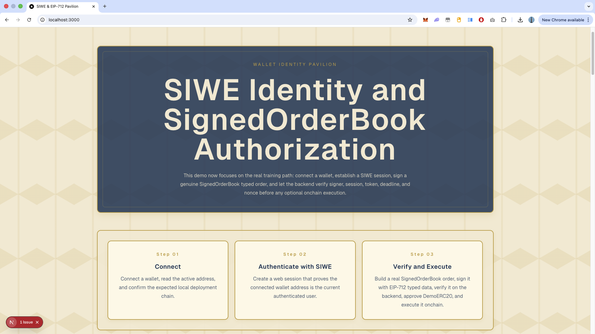

# SIWE + EIP-712 Demo

<p align="center">
  
</p>

## 1. 项目目标

这是一个最小但完整的 Web3 身份认证 + 业务签名 demo，演示两条经常被混在一起、但实际应该分离处理的链路：

1. 如何把“钱包地址控制权”转换成 Web 登录态。
2. 登录之后，如何对某一个具体业务动作发起 EIP-712 结构化签名，并在后端完成验签与防重放校验。

当前项目并不是单纯的“连接钱包 demo”。它把以下两件事情完整串起来了：

- `SIWE (Sign-In with Ethereum)`：用于登录认证，证明“当前用户确实控制这个钱包地址”，成功后建立 NextAuth session。
- `EIP-712 typed data signing`：用于业务授权，证明“当前已登录用户同意这个具体业务动作”，例如签订单、permit、profile update、白名单操作等。

本项目的核心目标是展示一个清晰的边界：

- 钱包连接态不等于登录态。
- 有了登录态也不等于业务已授权。
- 后端必须重新做 signer recovery、session 对比、业务字段对比、deadline 校验和 nonce 防重放校验。

## 2. 技术栈

以下内容基于 `package.json` 和当前代码实现整理。

### Next.js 16 + App Router

- 依赖：`next@16.2.4`
- 作用：承载前端页面、API routes 和整体应用结构。
- 实际使用位置：
  - 页面入口：[`src/app/page.tsx`](/Volumes/DevDisk/Dev/projects/web3-frontend-demos/siwe-eip712-demo/src/app/page.tsx)
  - 根布局：[`src/app/layout.tsx`](/Volumes/DevDisk/Dev/projects/web3-frontend-demos/siwe-eip712-demo/src/app/layout.tsx)
  - API routes：
    - [`src/app/api/auth/[...nextauth]/route.ts`](/Volumes/DevDisk/Dev/projects/web3-frontend-demos/siwe-eip712-demo/src/app/api/auth/[...nextauth]/route.ts)
    - [`src/app/api/orders/nonce/route.ts`](/Volumes/DevDisk/Dev/projects/web3-frontend-demos/siwe-eip712-demo/src/app/api/orders/nonce/route.ts)
    - [`src/app/api/orders/verify/route.ts`](/Volumes/DevDisk/Dev/projects/web3-frontend-demos/siwe-eip712-demo/src/app/api/orders/verify/route.ts)

### TypeScript

- 作用：为 session、order、typed data、API 返回结构等提供静态类型约束。
- 实际体现：
  - `MockOrderInput`
  - `MockOrderTypedData`
  - `VerifyResult`
  - `OrderFormInput`

### wagmi

- 依赖：`wagmi`
- 作用：管理钱包连接状态、当前链、当前地址，以及发起 typed data 签名。
- 实际使用：
  - [`src/lib/wallet.ts`](/Volumes/DevDisk/Dev/projects/web3-frontend-demos/siwe-eip712-demo/src/lib/wallet.ts) 中创建 wagmi 配置
  - `useAccount` / `useChainId` / `useSignTypedData`
  - [`src/hooks/useSiweStatusViewModel.ts`](/Volumes/DevDisk/Dev/projects/web3-frontend-demos/siwe-eip712-demo/src/hooks/useSiweStatusViewModel.ts)
  - [`src/hooks/useOrderSigner.ts`](/Volumes/DevDisk/Dev/projects/web3-frontend-demos/siwe-eip712-demo/src/hooks/useOrderSigner.ts)

### RainbowKit

- 依赖：`@rainbow-me/rainbowkit`
- 作用：提供连接钱包 UI 与钱包连接能力。
- 实际使用：
  - [`src/components/providers.tsx`](/Volumes/DevDisk/Dev/projects/web3-frontend-demos/siwe-eip712-demo/src/components/providers.tsx) 中的 `RainbowKitProvider`
  - [`src/components/siwe-status.tsx`](/Volumes/DevDisk/Dev/projects/web3-frontend-demos/siwe-eip712-demo/src/components/siwe-status.tsx) 中的 `ConnectButton`

### RainbowKit SIWE NextAuth

- 依赖：`@rainbow-me/rainbowkit-siwe-next-auth`
- 作用：把 RainbowKit 的钱包连接与 NextAuth 的 SIWE 登录流程串起来。
- 实际使用：
  - [`src/components/providers.tsx`](/Volumes/DevDisk/Dev/projects/web3-frontend-demos/siwe-eip712-demo/src/components/providers.tsx) 中的 `RainbowKitSiweNextAuthProvider`

### NextAuth

- 依赖：`next-auth`
- 作用：建立和维护 Web 登录态。
- 当前实现方式：
  - 使用 `CredentialsProvider`
  - `authorize` 中验证 SIWE message + signature
  - session 使用 `jwt` strategy
  - 登录地址被写入 `token.sub` 和 `session.user.name`
- 实际代码：
  - 配置：[`src/lib/auth.ts`](/Volumes/DevDisk/Dev/projects/web3-frontend-demos/siwe-eip712-demo/src/lib/auth.ts)
  - Route：[`src/app/api/auth/[...nextauth]/route.ts`](/Volumes/DevDisk/Dev/projects/web3-frontend-demos/siwe-eip712-demo/src/app/api/auth/[...nextauth]/route.ts)

### SIWE

- 依赖：`siwe`
- 作用：验证登录消息，证明用户控制某个钱包地址。
- 实际使用：
  - [`src/lib/auth.ts`](/Volumes/DevDisk/Dev/projects/web3-frontend-demos/siwe-eip712-demo/src/lib/auth.ts)
  - `new SiweMessage(credentials.message)`
  - `siwe.verify(...)`

### viem

- 依赖：`viem`
- 作用：做地址校验、地址比较、EIP-712 签名恢复。
- 实际使用：
  - `isAddress`
  - `isAddressEqual`
  - `recoverTypedDataAddress`
- 代码位置：
  - [`src/app/api/orders/nonce/route.ts`](/Volumes/DevDisk/Dev/projects/web3-frontend-demos/siwe-eip712-demo/src/app/api/orders/nonce/route.ts)
  - [`src/app/api/orders/verify/route.ts`](/Volumes/DevDisk/Dev/projects/web3-frontend-demos/siwe-eip712-demo/src/app/api/orders/verify/route.ts)

### EIP-712 Typed Data

- 作用：定义结构化业务签名的数据域、类型、消息体。
- 当前 demo 的签名对象是 `Order`：
  - `maker`
  - `token`
  - `amount`
  - `price`
  - `deadline`
  - `nonce`
- 代码位置：
  - [`src/lib/eip712.ts`](/Volumes/DevDisk/Dev/projects/web3-frontend-demos/siwe-eip712-demo/src/lib/eip712.ts)

### Tailwind CSS 4

- 依赖：`tailwindcss`, `@tailwindcss/postcss`
- 作用：页面与组件样式实现。
- 实际文件：
  - [`src/app/globals.css`](/Volumes/DevDisk/Dev/projects/web3-frontend-demos/siwe-eip712-demo/src/app/globals.css)
  - 组件中大量 `className`

### Zod

- 依赖：`zod`
- 作用：验证 order 表单输入和完整 order payload。
- 实际使用：
  - [`src/lib/eip712.ts`](/Volumes/DevDisk/Dev/projects/web3-frontend-demos/siwe-eip712-demo/src/lib/eip712.ts)
  - `orderFormSchema`
  - `orderInputSchema`

### react-hook-form

- 依赖：`react-hook-form`
- 作用：管理业务签名表单。
- 实际使用：
  - [`src/components/order-signer.tsx`](/Volumes/DevDisk/Dev/projects/web3-frontend-demos/siwe-eip712-demo/src/components/order-signer.tsx)

### @hookform/resolvers

- 依赖：`@hookform/resolvers`
- 作用：把 Zod schema 接到 `react-hook-form`。
- 实际使用：
  - [`src/components/order-signer.tsx`](/Volumes/DevDisk/Dev/projects/web3-frontend-demos/siwe-eip712-demo/src/components/order-signer.tsx)

### @tanstack/react-query

- 依赖：`@tanstack/react-query`
- 作用：作为 RainbowKit / wagmi 常见配套基础设施提供 `QueryClientProvider`。
- 实际使用：
  - [`src/components/providers.tsx`](/Volumes/DevDisk/Dev/projects/web3-frontend-demos/siwe-eip712-demo/src/components/providers.tsx)

## 3. 核心链路

这一章是整个 README 的重点，按当前真实代码说明。

### 总览

完整链路如下：

```text
connect wallet
→ SIWE login
→ NextAuth session
→ request order nonce
→ build EIP-712 typed data
→ wallet sign typed data
→ frontend submit order + signature
→ backend recover signer
→ compare recovered signer with session address
→ compare order.maker with session address
→ check deadline
→ consume nonce
→ return verified result
```

### 1. Connect wallet

- 负责组件：[`src/components/siwe-status.tsx`](/Volumes/DevDisk/Dev/projects/web3-frontend-demos/siwe-eip712-demo/src/components/siwe-status.tsx)
- 关键 UI：`<ConnectButton />`
- 状态来源：
  - [`src/hooks/useSiweStatusViewModel.ts`](/Volumes/DevDisk/Dev/projects/web3-frontend-demos/siwe-eip712-demo/src/hooks/useSiweStatusViewModel.ts)
  - `useAccount()`
  - `useChainId()`
- Provider 装配：
  - [`src/components/providers.tsx`](/Volumes/DevDisk/Dev/projects/web3-frontend-demos/siwe-eip712-demo/src/components/providers.tsx)
  - `WagmiProvider`
  - `RainbowKitProvider`

为什么需要这一步：

- 没有钱包连接，就没有可用地址，也无法进行 SIWE 登录和 EIP-712 业务签名。

### 2. SIWE login

- 连接逻辑提供者：`RainbowKitSiweNextAuthProvider`
  - 位置：[`src/components/providers.tsx`](/Volumes/DevDisk/Dev/projects/web3-frontend-demos/siwe-eip712-demo/src/components/providers.tsx)
- 后端认证入口：
  - [`src/app/api/auth/[...nextauth]/route.ts`](/Volumes/DevDisk/Dev/projects/web3-frontend-demos/siwe-eip712-demo/src/app/api/auth/[...nextauth]/route.ts)
- 真正的认证配置：
  - [`src/lib/auth.ts`](/Volumes/DevDisk/Dev/projects/web3-frontend-demos/siwe-eip712-demo/src/lib/auth.ts)

关键过程：

1. 钱包对 SIWE message 签名。
2. NextAuth `CredentialsProvider.authorize` 收到 `message` 和 `signature`。
3. `new SiweMessage(credentials.message)` 解析消息。
4. 通过 `getCsrfToken(...)` 获取 NextAuth CSRF token。
5. `siwe.verify(...)` 验证：
   - signature
   - domain（来自 `NEXTAUTH_URL`）
   - nonce（这里使用 NextAuth csrfToken）
6. 验证通过后，返回 `{ id: siwe.address, name: siwe.address }`。

为什么需要这一步：

- 这一步解决的是“用户是谁”。
- 不是授权业务，而是建立一个可持续使用的 Web session。

### 3. NextAuth session

- 配置位置：[`src/lib/auth.ts`](/Volumes/DevDisk/Dev/projects/web3-frontend-demos/siwe-eip712-demo/src/lib/auth.ts)
- Session provider：
  - [`src/components/providers.tsx`](/Volumes/DevDisk/Dev/projects/web3-frontend-demos/siwe-eip712-demo/src/components/providers.tsx)

关键实现：

- `session.strategy = "jwt"`
- `jwt` callback：把 `user.name` 写入 `token.sub`
- `session` callback：把 `token.sub` 写入 `session.user.name`

当前项目中，钱包地址最终放在：

```ts
session.user.name;
```

为什么需要这一步：

- 后续 `/api/orders/nonce` 和 `/api/orders/verify` 都要从 session 中取出当前认证地址。

### 4. Request order nonce

- 前端发起位置：
  - [`src/hooks/useOrderSigner.ts`](/Volumes/DevDisk/Dev/projects/web3-frontend-demos/siwe-eip712-demo/src/hooks/useOrderSigner.ts)
  - 函数：`requestOrderNonce()`
- 后端接口：
  - [`src/app/api/orders/nonce/route.ts`](/Volumes/DevDisk/Dev/projects/web3-frontend-demos/siwe-eip712-demo/src/app/api/orders/nonce/route.ts)
- nonce 存储：
  - [`src/lib/order-nonce-store.ts`](/Volumes/DevDisk/Dev/projects/web3-frontend-demos/siwe-eip712-demo/src/lib/order-nonce-store.ts)

关键过程：

1. 前端 `POST /api/orders/nonce`
2. 后端 `getServerSession(authOptions)`
3. 从 `session.user.name` 取出 `sessionAddress`
4. 用 `isAddress(sessionAddress)` 校验地址格式
5. 调用 `createOrderNonce(sessionAddress)`
6. 返回：
   - `nonce`
   - `expiresAt`

为什么需要这一步：

- 业务签名必须有防重放字段。
- 当前项目明确规定：nonce 必须由后端签名前发放，前端不能自己生成。

### 5. Build EIP-712 typed data

- 位置：
  - [`src/hooks/useOrderSigner.ts`](/Volumes/DevDisk/Dev/projects/web3-frontend-demos/siwe-eip712-demo/src/hooks/useOrderSigner.ts)
  - [`src/lib/eip712.ts`](/Volumes/DevDisk/Dev/projects/web3-frontend-demos/siwe-eip712-demo/src/lib/eip712.ts)

相关函数：

- `buildOrder(values, nonce)`
- `orderInputSchema.safeParse(order)`
- `toOrderTypedData(parsedOrder.data)`
- `getOrderDomain(chainId)`

当前 order 结构：

```ts
{
  (maker, token, amount, price, deadline, nonce);
}
```

当前 domain：

```ts
{
  name: "SIWE EIP712 Demo",
  version: "1",
  chainId,
  verifyingContract: "0x0000000000000000000000000000000000000000"
}
```

为什么需要这一步：

- EIP-712 签名不是随便签一段字符串，而是对有结构的业务数据签名。
- domain 和 types 让后端可以在同样规则下恢复 signer。

### 6. Wallet sign typed data

- 位置：[`src/hooks/useOrderSigner.ts`](/Volumes/DevDisk/Dev/projects/web3-frontend-demos/siwe-eip712-demo/src/hooks/useOrderSigner.ts)
- 关键函数：`signTypedDataAsync`

调用方式：

```ts
await signTypedDataAsync({
  domain: getOrderDomain(chainId),
  types: orderTypes,
  primaryType: "Order",
  message: typedOrder,
});
```

为什么需要这一步：

- 这一签名表达的是“当前钱包控制者同意这个具体 order 内容”。
- 这不是登录签名，而是业务授权签名。

### 7. Frontend submit order + signature

- 位置：[`src/hooks/useOrderSigner.ts`](/Volumes/DevDisk/Dev/projects/web3-frontend-demos/siwe-eip712-demo/src/hooks/useOrderSigner.ts)
- 关键函数：`signAndVerify(values)`

签名成功后，前端提交：

```json
{
  "chainId": 1,
  "order": { "...": "..." },
  "signature": "0x..."
}
```

提交地址：

```text
POST /api/orders/verify
```

为什么需要这一步：

- 钱包签完并不代表业务完成，后端必须独立验签。

### 8. Backend recover signer

- 位置：[`src/app/api/orders/verify/route.ts`](/Volumes/DevDisk/Dev/projects/web3-frontend-demos/siwe-eip712-demo/src/app/api/orders/verify/route.ts)

关键函数：

- `recoverTypedDataAddress(...)`

实际逻辑：

1. 校验 session 是否存在
2. 校验 `body.order`
3. 校验 `body.signature`
4. 校验 `body.chainId`
5. 用 `getOrderDomain(body.chainId)` + `orderTypes` + `typedOrder` + `signature`
6. 恢复签名地址 `recoveredAddress`

为什么需要这一步：

- 后端不能信任前端传来的“这是我签的”。
- 必须自己恢复 signer，才能知道签名到底对应哪个钱包地址。

### 9. Compare recovered signer with session address

- 位置：[`src/app/api/orders/verify/route.ts`](/Volumes/DevDisk/Dev/projects/web3-frontend-demos/siwe-eip712-demo/src/app/api/orders/verify/route.ts)

关键逻辑：

```ts
const signerMatchesSession = isAddressEqual(recoveredAddress, sessionAddress);
```

为什么需要这一步：

- 防止“已登录 A 地址，但拿 B 地址的签名来提交”。
- 业务签名人必须和当前登录 session 对应的地址一致。

### 10. Compare order.maker with session address

- 同样位于 `/api/orders/verify`

关键逻辑：

```ts
const makerMatchesSession = isAddressEqual(orderMaker, sessionAddress);
```

为什么需要这一步：

- 防止签名地址虽然正确，但 order 里声称的业务主体不是当前 session 地址。
- 这一步确保：
  - 签名者是 session 地址
  - order 声明的 maker 也是 session 地址

### 11. Check deadline

- 位置：[`src/app/api/orders/verify/route.ts`](/Volumes/DevDisk/Dev/projects/web3-frontend-demos/siwe-eip712-demo/src/app/api/orders/verify/route.ts)

关键逻辑：

```ts
if (Number(orderInput.deadline) < now) {
  ...
}
```

为什么需要这一步：

- 防止旧授权长期有效。
- 当前前端默认把 deadline 设置为“当前时间 + 10 分钟”。

### 12. Consume nonce

- 后端校验位置：
  - [`src/app/api/orders/verify/route.ts`](/Volumes/DevDisk/Dev/projects/web3-frontend-demos/siwe-eip712-demo/src/app/api/orders/verify/route.ts)
- nonce store：
  - [`src/lib/order-nonce-store.ts`](/Volumes/DevDisk/Dev/projects/web3-frontend-demos/siwe-eip712-demo/src/lib/order-nonce-store.ts)

关键逻辑：

```ts
const nonceResult = consumeOrderNonce({
  address: sessionAddress,
  nonce: orderInput.nonce,
});
```

为什么需要这一步：

- 即使签名合法，也不能允许同一个授权被无限重放。

### 13. Return verified result

- 位置：[`src/app/api/orders/verify/route.ts`](/Volumes/DevDisk/Dev/projects/web3-frontend-demos/siwe-eip712-demo/src/app/api/orders/verify/route.ts)

成功时返回：

```json
{
  "ok": true,
  "verified": true,
  "sessionAddress": "...",
  "recoveredAddress": "...",
  "order": { "...": "..." }
}
```

UI 展示位置：

- [`src/components/order-signer.tsx`](/Volumes/DevDisk/Dev/projects/web3-frontend-demos/siwe-eip712-demo/src/components/order-signer.tsx)

## 4. 文件结构

以下是当前项目中与核心链路相关的关键文件。

### App 入口与布局

- [`src/app/layout.tsx`](/Volumes/DevDisk/Dev/projects/web3-frontend-demos/siwe-eip712-demo/src/app/layout.tsx)
  - 根布局。
  - 引入全局样式。
  - 注入 `Providers`。

- [`src/app/page.tsx`](/Volumes/DevDisk/Dev/projects/web3-frontend-demos/siwe-eip712-demo/src/app/page.tsx)
  - 当前唯一页面入口。
  - 同时渲染：
    - `SiweStatus`
    - `OrderSigner`
    - `SignatureFlowExplainer`
  - 当前项目没有独立的 `/sign` 页面；签名 UI 就在首页。

- [`src/app/globals.css`](/Volumes/DevDisk/Dev/projects/web3-frontend-demos/siwe-eip712-demo/src/app/globals.css)
  - 全局样式和视觉主题。

### 钱包配置

- [`src/lib/wallet.ts`](/Volumes/DevDisk/Dev/projects/web3-frontend-demos/siwe-eip712-demo/src/lib/wallet.ts)
  - 使用 `getDefaultConfig(...)` 创建 RainbowKit / wagmi 配置。
  - 配置了：
    - `appName`
    - `projectId`
    - `chains: [mainnet, sepolia]`
    - `ssr: true`

### NextAuth / SIWE 配置

- [`src/lib/auth.ts`](/Volumes/DevDisk/Dev/projects/web3-frontend-demos/siwe-eip712-demo/src/lib/auth.ts)
  - 整个登录认证的核心配置文件。
  - 负责：
    - `CredentialsProvider`
    - SIWE message 验证
    - jwt callback
    - session callback
    - secret 配置

- [`src/app/api/auth/[...nextauth]/route.ts`](/Volumes/DevDisk/Dev/projects/web3-frontend-demos/siwe-eip712-demo/src/app/api/auth/[...nextauth]/route.ts)
  - 暴露 NextAuth 的 GET / POST handler。

### Provider 入口

- [`src/components/providers.tsx`](/Volumes/DevDisk/Dev/projects/web3-frontend-demos/siwe-eip712-demo/src/components/providers.tsx)
  - 应用级 provider 装配点。
  - 包含：
    - `WagmiProvider`
    - `QueryClientProvider`
    - `SessionProvider`
    - `RainbowKitSiweNextAuthProvider`
    - `RainbowKitProvider`

### 登录状态 UI

- [`src/components/siwe-status.tsx`](/Volumes/DevDisk/Dev/projects/web3-frontend-demos/siwe-eip712-demo/src/components/siwe-status.tsx)
  - 显示钱包连接状态。
  - 显示 session 状态。
  - 提供 `ConnectButton`。
  - 已登录时允许 `signOut()`。

### SIWE session guard hook

- [`src/hooks/useSiweSessionGuard.ts`](/Volumes/DevDisk/Dev/projects/web3-frontend-demos/siwe-eip712-demo/src/hooks/useSiweSessionGuard.ts)
  - 当前 session 存在时，如果：
    - 钱包断开
    - 当前连接地址和 sessionAddress 不一致
    - 链发生变化
  - 会自动调用 `signOut()`

- [`src/hooks/useSiweStatusViewModel.ts`](/Volumes/DevDisk/Dev/projects/web3-frontend-demos/siwe-eip712-demo/src/hooks/useSiweStatusViewModel.ts)
  - 包装钱包状态和 session 状态。
  - 在内部调用 `useSiweSessionGuard(...)`。

### EIP-712 domain / types / schema

- [`src/lib/eip712.ts`](/Volumes/DevDisk/Dev/projects/web3-frontend-demos/siwe-eip712-demo/src/lib/eip712.ts)
  - 负责：
    - 地址 schema
    - bytes32 schema
    - `orderFormSchema`
    - `orderInputSchema`
    - `orderTypes`
    - `getOrderDomain(chainId)`
    - `toOrderTypedData(order)`

### 业务签名 hook

- [`src/hooks/useOrderSigner.ts`](/Volumes/DevDisk/Dev/projects/web3-frontend-demos/siwe-eip712-demo/src/hooks/useOrderSigner.ts)
  - 负责整个业务签名链路：
    - 读取 wallet/session 状态
    - 计算 `canSign`
    - 请求 order nonce
    - 构造 order
    - 校验 order
    - 发起 typed data 签名
    - 提交后端验签
    - 保存 `signature` / `result` / `errorMessage`

### Order signer UI

- [`src/components/order-signer.tsx`](/Volumes/DevDisk/Dev/projects/web3-frontend-demos/siwe-eip712-demo/src/components/order-signer.tsx)
  - 表单 UI。
  - 显示 session snapshot。
  - 调用 `useOrderSigner()`
  - 展示：
    - 签名结果
    - 后端验证结果
    - 错误提示

### `/api/orders/nonce`

- [`src/app/api/orders/nonce/route.ts`](/Volumes/DevDisk/Dev/projects/web3-frontend-demos/siwe-eip712-demo/src/app/api/orders/nonce/route.ts)
  - 只允许有合法 session 的用户请求 nonce。
  - 返回后端生成的 nonce 与过期时间。

### `/api/orders/verify`

- [`src/app/api/orders/verify/route.ts`](/Volumes/DevDisk/Dev/projects/web3-frontend-demos/siwe-eip712-demo/src/app/api/orders/verify/route.ts)
  - 业务签名验签的核心后端入口。
  - 承担：
    - session 校验
    - order payload 校验
    - signature 格式校验
    - chainId 校验
    - signer recovery
    - recovered signer 与 session 地址比对
    - order.maker 与 session 地址比对
    - deadline 校验
    - nonce 消费

### nonce store

- [`src/lib/order-nonce-store.ts`](/Volumes/DevDisk/Dev/projects/web3-frontend-demos/siwe-eip712-demo/src/lib/order-nonce-store.ts)
  - 当前用 `globalThis + Map` 做内存级 nonce store。
  - 提供：
    - `createOrderNonce(address)`
    - `consumeOrderNonce({ address, nonce })`

## 5. SIWE 和 EIP-712 的区别

这两者不是同一个东西。

### SIWE 是登录认证

- 解决的问题：证明“这个钱包地址由当前用户控制”。
- 本项目中的实现：
  - 钱包签 SIWE login message
  - 后端在 [`src/lib/auth.ts`](/Volumes/DevDisk/Dev/projects/web3-frontend-demos/siwe-eip712-demo/src/lib/auth.ts) 里调用 `siwe.verify(...)`
  - 验证成功后建立 NextAuth session

结果：

- 产生的是 Web 登录态，即 session。

### EIP-712 是业务授权

- 解决的问题：证明“当前登录用户同意某一个具体业务动作”。
- 本项目中的实现：
  - 当前业务对象是 `order`
  - 前端构造 typed data
  - 钱包签 `Order`
  - 后端 recover signer 并做业务校验

结果：

- 产生的是可验证的业务授权，而不是登录态。

### 在本项目中的具体区别

- SIWE 签的是登录消息。
- EIP-712 签的是结构化业务数据 `order`。
- SIWE 成功后产生 session。
- EIP-712 成功后产生可验证的业务授权。
- 两者都不是链上交易。
- 两者都不消耗 gas。

## 6. nonce 防重放机制

当前项目实现了一套明确的业务 nonce 机制。

### 当前实现规则

1. 前端不自己生成 nonce。
2. 前端在签名前先请求 `/api/orders/nonce`。
3. 后端基于当前 `sessionAddress` 生成 nonce。
4. nonce 有过期时间。
5. 前端把 nonce 放进 EIP-712 order。
6. 后端验签成功后消费 nonce。
7. 同一个 order + signature 不能重复提交。

### 代码实现

- 创建 nonce：
  - [`src/lib/order-nonce-store.ts`](/Volumes/DevDisk/Dev/projects/web3-frontend-demos/siwe-eip712-demo/src/lib/order-nonce-store.ts)
  - `createOrderNonce(address)`

- 消费 nonce：
  - [`src/lib/order-nonce-store.ts`](/Volumes/DevDisk/Dev/projects/web3-frontend-demos/siwe-eip712-demo/src/lib/order-nonce-store.ts)
  - `consumeOrderNonce({ address, nonce })`

- TTL：
  - `NONCE_TTL_MS = 10 * 60 * 1000`

### 当前存储方式的限制

当前 demo 使用的是：

```ts
globalThis.orderNonceStore ?? new Map<string, NonceRecord>();
```

这意味着它只适合本地开发和单进程 demo，不适合生产环境。

原因：

- Serverless 场景下，实例可能随时销毁。
- 进程重启后内存状态会丢失。
- 多实例部署时，不同实例之间不会共享这份 `Map`。

生产环境建议改成：

- Redis
- 数据库表
- 其他持久化 KV 存储

## 7. 本地运行步骤

以下步骤基于当前仓库的真实实现。

### 1. 安装依赖

```bash
npm install
```

### 2. 配置 `.env.local`

当前代码实际依赖以下环境变量：

```bash
NEXTAUTH_URL=http://localhost:3000
NEXTAUTH_SECRET=your-secret
NEXT_PUBLIC_WALLETCONNECT_PROJECT_ID=your-walletconnect-project-id
```

变量用途：

- `NEXTAUTH_URL`
  - 用于 SIWE 验证时校验 domain。
  - 在 [`src/lib/auth.ts`](/Volumes/DevDisk/Dev/projects/web3-frontend-demos/siwe-eip712-demo/src/lib/auth.ts) 中使用。

- `NEXTAUTH_SECRET`
  - NextAuth secret。
  - 在 [`src/lib/auth.ts`](/Volumes/DevDisk/Dev/projects/web3-frontend-demos/siwe-eip712-demo/src/lib/auth.ts) 中使用。

- `NEXT_PUBLIC_WALLETCONNECT_PROJECT_ID`
  - RainbowKit / WalletConnect 所需 projectId。
  - 在 [`src/lib/wallet.ts`](/Volumes/DevDisk/Dev/projects/web3-frontend-demos/siwe-eip712-demo/src/lib/wallet.ts) 中使用。

### 3. 启动开发服务器

```bash
npm run dev
```

### 4. 打开首页

```text
http://localhost:3000
```

注意：

- 当前项目没有单独的 `/sign` 页面。
- 业务签名表单已经直接渲染在首页 [`src/app/page.tsx`](/Volumes/DevDisk/Dev/projects/web3-frontend-demos/siwe-eip712-demo/src/app/page.tsx) 中。
- 因此“打开 `/sign`”这一点在当前仓库中未实现。

### 5. 连接钱包

- 点击页面中的 `ConnectButton`
- 选择钱包并连接

### 6. 完成 SIWE 登录

- 通过 RainbowKit + NextAuth 串起的 SIWE 登录流程完成登录
- 登录成功后，在 `SIWE Session Portal` 区域能看到：
  - `Session status`
  - `Authenticated address`
  - `Auth state`

### 7. 填写 order 表单并点击 `Sign Order`

- 默认字段已填入 demo 数据：
  - `token`
  - `amount`
  - `price`

点击 `Sign Order` 后，前端会自动：

1. 请求 `/api/orders/nonce`
2. 构造 order
3. 发起 EIP-712 typed data 签名
4. 提交 `/api/orders/verify`

### 8. 查看结果

页面会展示：

- `Signature`
- `Backend Verify Result`

## 8. 可测试的异常场景

以下测试项均基于当前代码可验证的逻辑整理。

### 1. 未登录直接点击 `Sign Order`

- 预期结果：
  - 前端报错：`You must connect wallet and complete SIWE login first.`
- 验证层：
  - 前端 `canSign` 保护
  - `useOrderSigner.ts`

### 2. 未登录直接请求 `/api/orders/nonce`

- 预期结果：
  - 返回 `401`
  - `UNAUTHORIZED`
- 验证层：
  - 后端 session 校验

### 3. 未登录直接请求 `/api/orders/verify`

- 预期结果：
  - 返回 `401`
  - `Session is missing or expired.`
- 验证层：
  - 后端 session 校验

### 4. 登录后切换钱包地址

- 预期结果：
  - 前端 `useSiweSessionGuard` 自动 `signOut()`
- 验证层：
  - session 与当前连接钱包地址绑定

### 5. 登录后切换链

- 预期结果：
  - 前端 `useSiweSessionGuard` 自动 `signOut()`
- 验证层：
  - session 与登录时钱包上下文绑定

### 6. 修改 `order.maker` 为其他地址

- 预期结果：
  - `/api/orders/verify` 返回 `403`
  - `ADDRESS_MISMATCH`
- 验证层：
  - `order.maker` 与 `sessionAddress` 比对

说明：

- 当前默认 UI 不允许直接修改 `maker`，因为 `maker` 在 `buildOrder(...)` 中固定取当前连接地址。
- 如需测试，需要通过前端调试或直接构造请求 payload。

### 7. 修改 signature

- 预期结果：
  - 可能返回 `ADDRESS_MISMATCH`
  - 或直接无法恢复为合法 signer
- 验证层：
  - signer recovery
  - recovered signer 与 session 地址比对

### 8. 使用过期 deadline

- 预期结果：
  - 返回 `400`
  - `ORDER_EXPIRED`
- 验证层：
  - 业务时间有效期校验

说明：

- 当前 UI 中 `deadline` 由 `buildOrder(...)` 自动生成为“现在 + 10 分钟”。
- 如需测试，需要手动改请求体或调试代码。

### 9. 重复提交同一个 order + signature

- 预期结果：
  - 第一次成功
  - 第二次失败，返回 nonce 相关错误
- 验证层：
  - nonce 消费逻辑
  - 防重放保护

### 10. nonce 不存在

- 预期结果：
  - 返回 `NONCE_NOT_FOUND`
- 验证层：
  - 后端 nonce 存在性校验

### 11. nonce 已被消费

- 预期结果：
  - 当前实现通常返回 `NONCE_NOT_FOUND`
  - 因为 `consumeOrderNonce(...)` 成功后会 `store.delete(nonce)`
- 验证层：
  - 防重放

补充说明：

- `NONCE_ALREADY_USED` 这个错误码在 store 中定义了，但由于成功消费后立即删除 nonce，实际“重复提交同一个已成功消费的 nonce”更常落到 `NONCE_NOT_FOUND`。

### 12. nonce 过期

- 预期结果：
  - 返回 `NONCE_EXPIRED`
- 验证层：
  - nonce TTL 校验

### 13. session 失效

- 预期结果：
  - `/api/orders/nonce` 或 `/api/orders/verify` 返回 `401`
- 验证层：
  - NextAuth session 校验

## 9. 核心代码逻辑说明

这里不复制整个文件，只解释关键逻辑。

### 9.1 NextAuth CredentialsProvider 如何验证 SIWE

位置：[`src/lib/auth.ts`](/Volumes/DevDisk/Dev/projects/web3-frontend-demos/siwe-eip712-demo/src/lib/auth.ts)

核心过程：

1. 读取 `credentials.message` 和 `credentials.signature`
2. `new SiweMessage(credentials.message)`
3. 从 `NEXTAUTH_URL` 取 domain
4. 调 `getCsrfToken({ req: { headers: req.headers } })`
5. 执行：

```ts
await siwe.verify({
  signature: credentials.signature,
  domain: new URL(nextAuthUrl).host,
  nonce: csrfToken,
});
```

6. 验证通过后返回地址作为 user：

```ts
return {
  id: siwe.address,
  name: siwe.address,
};
```

要点：

- 这里的 SIWE nonce 使用的是 NextAuth CSRF token。
- session 中最终持久化的是钱包地址。

### 9.2 RainbowKitSiweNextAuthProvider 如何把钱包连接和 SIWE 登录串起来

位置：[`src/components/providers.tsx`](/Volumes/DevDisk/Dev/projects/web3-frontend-demos/siwe-eip712-demo/src/components/providers.tsx)

当前 provider 组合顺序：

1. `WagmiProvider`
2. `QueryClientProvider`
3. `SessionProvider`
4. `RainbowKitSiweNextAuthProvider`
5. `RainbowKitProvider`

作用：

- `ConnectButton` 来自 RainbowKit
- `RainbowKitSiweNextAuthProvider` 负责让 RainbowKit 与 NextAuth 的 SIWE 登录流程配合工作
- `SessionProvider` 让前端能通过 `useSession()` 读取登录态

### 9.3 useSiweSessionGuard 如何处理 account change / chain change 后自动 signOut

位置：[`src/hooks/useSiweSessionGuard.ts`](/Volumes/DevDisk/Dev/projects/web3-frontend-demos/siwe-eip712-demo/src/hooks/useSiweSessionGuard.ts)

逻辑分两部分：

1. 地址和连接状态校验

```ts
if (!isConnected || !address) {
  signOut();
}

if (normalizedSessionAddress !== normalizedWalletAddress) {
  signOut();
}
```

2. 链变化校验

```ts
if (
  previousChainIdRef.current !== undefined &&
  previousChainIdRef.current !== chainId
) {
  signOut();
}
```

作用：

- 防止“登录后换地址仍继续使用原 session”
- 防止“登录后切链仍继续使用原 session”

### 9.4 EIP-712 domain / types / message 如何构造

位置：[`src/lib/eip712.ts`](/Volumes/DevDisk/Dev/projects/web3-frontend-demos/siwe-eip712-demo/src/lib/eip712.ts)

核心内容：

- `orderTypes`
- `getOrderDomain(chainId)`
- `toOrderTypedData(order)`

当前 `Order` 类型为：

```ts
[
  { name: "maker", type: "address" },
  { name: "token", type: "address" },
  { name: "amount", type: "uint256" },
  { name: "price", type: "uint256" },
  { name: "deadline", type: "uint256" },
  { name: "nonce", type: "bytes32" },
];
```

当前 demo 的 `verifyingContract` 是零地址：

```ts
"0x0000000000000000000000000000000000000000";
```

这说明它是一个演示型 typed data domain，不代表当前项目存在真实链上合约校验流程。

### 9.5 useOrderSigner 如何请求 nonce、发起 typed data 签名、提交后端验证

位置：[`src/hooks/useOrderSigner.ts`](/Volumes/DevDisk/Dev/projects/web3-frontend-demos/siwe-eip712-demo/src/hooks/useOrderSigner.ts)

关键步骤都在 `signAndVerify(values)`：

1. 检查 `chainId`
2. 检查 `canSign`
3. `requestOrderNonce()`
4. `buildOrder(values, nonce)`
5. `orderInputSchema.safeParse(order)`
6. `toOrderTypedData(parsedOrder.data)`
7. `signTypedDataAsync(...)`
8. 提交 `/api/orders/verify`
9. 保存后端返回结果

`canSign` 的计算也很关键：

```ts
const canSign =
  isConnected &&
  Boolean(address) &&
  status === "authenticated" &&
  sessionAddress?.toLowerCase() === address?.toLowerCase();
```

这保证了：

- 钱包已连接
- session 已认证
- session 地址和当前连接钱包地址一致

### 9.6 /api/orders/verify 如何 recover signer 并校验 sessionAddress、order.maker、deadline、nonce

位置：[`src/app/api/orders/verify/route.ts`](/Volumes/DevDisk/Dev/projects/web3-frontend-demos/siwe-eip712-demo/src/app/api/orders/verify/route.ts)

执行顺序：

1. `getServerSession(authOptions)`
2. 校验 `session.user.name`
3. `orderInputSchema.safeParse(body.order)`
4. 校验 `body.signature`
5. 校验 `body.chainId`
6. `recoverTypedDataAddress(...)`
7. 比对 `recoveredAddress` 与 `sessionAddress`
8. 比对 `order.maker` 与 `sessionAddress`
9. 校验 `deadline`
10. `consumeOrderNonce(...)`
11. 返回 `verified: true`

这个 route 是整个项目安全边界的核心实现。

### 9.7 nonce store 如何 create nonce 和 consume nonce

位置：[`src/lib/order-nonce-store.ts`](/Volumes/DevDisk/Dev/projects/web3-frontend-demos/siwe-eip712-contracthook/src/lib/order-nonce-store.ts)

#### createOrderNonce(address)

- 生成 32 字节随机数：

```ts
randomBytes(32).toString("hex");
```

- 保存内容：
  - address
  - nonce
  - expiresAt
  - used

#### consumeOrderNonce({ address, nonce })

依次检查：

1. nonce 是否存在
2. 是否已使用
3. 是否过期
4. nonce 所属地址是否和当前地址一致

通过后：

- `record.used = true`
- `store.delete(params.nonce)`

## 10. 项目作用总结

这个 demo 的实际意义在于：它不是普通的连接钱包 demo，而是一个完整展示 Web3 登录认证与业务签名授权边界的示例。

它清楚地展示了：

- 钱包连接态和 Web 登录态应该分离。
- `SIWE` 负责认证身份。
- `EIP-712` 负责授权具体业务动作。
- 后端必须进行：
  - signer recovery
  - session 对比
  - maker 对比
  - deadline 校验
  - nonce 防重放校验

因此，这个项目非常适合作为以下场景的基础模板：

- 订单签名
- 白名单授权
- profile update 授权
- permit 类业务
- 任何“先登录，再对具体业务 payload 做离线签名授权”的 Web3 应用

## 当前未实现 / 后续可补充项

以下内容是根据当前仓库真实状态整理，不做虚构：

- 当前没有独立的 `/sign` 页面，签名 UI 直接在首页。
- 当前 nonce store 是内存 `Map`，不适合生产部署。
- 当前没有数据库。
- 当前没有持久化审计日志。
- 当前没有真实链上合约交互。
- 当前 `verifyingContract` 使用的是零地址，仅用于 demo。
- 当前没有单元测试或集成测试文件。
